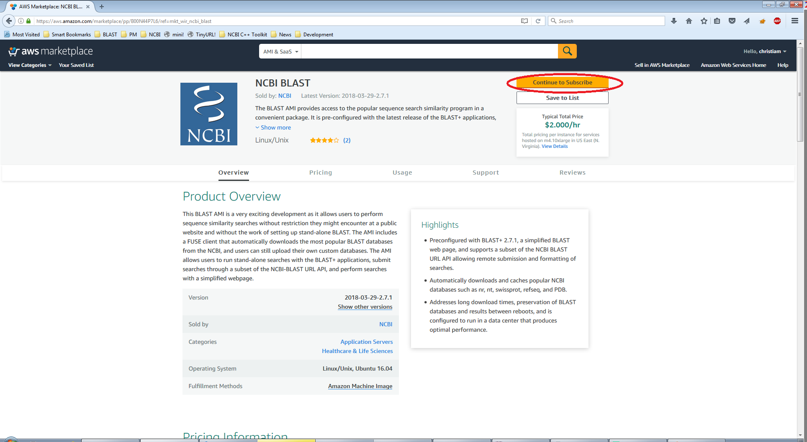
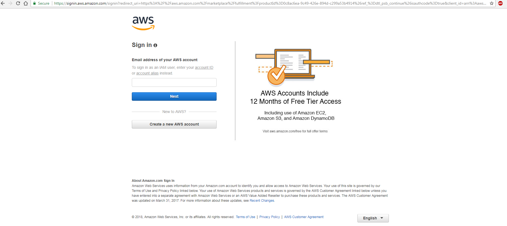
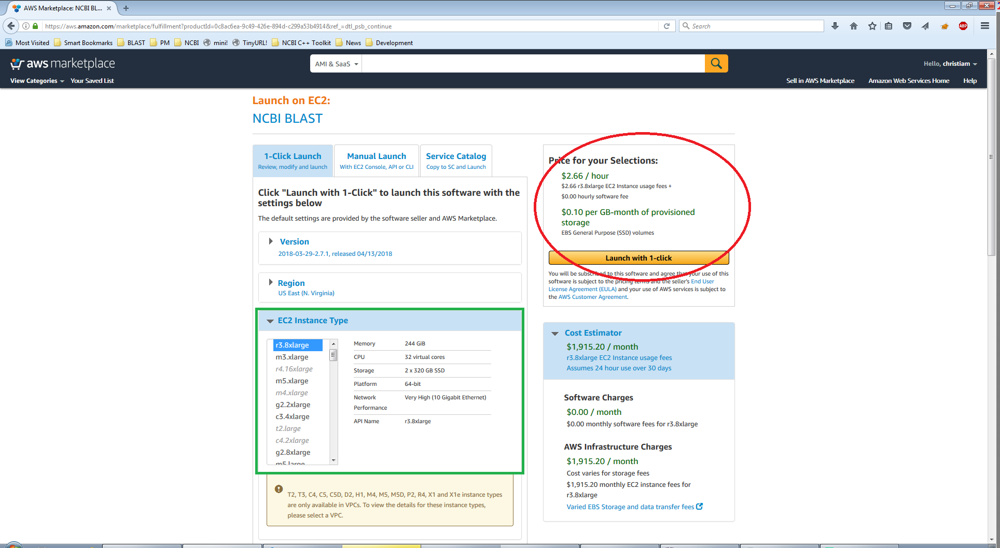
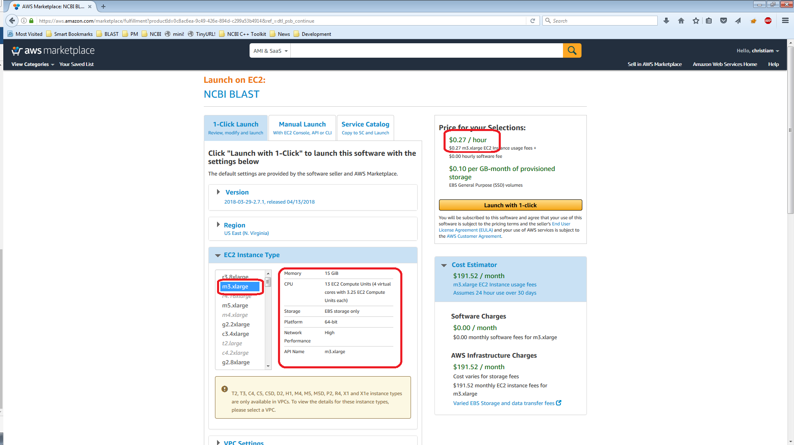
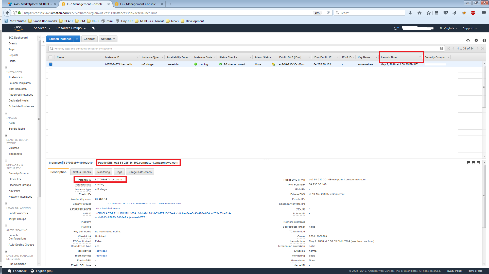
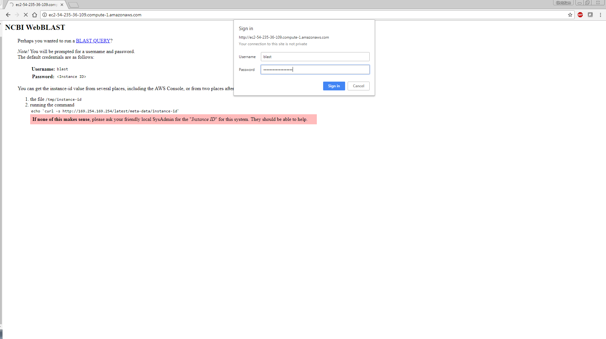

An account is required with Amazon Web Services (AWS). As cloud providers rapidly change their product offerings, please consult their cloud documentation first.

1. Go to the [NCBI BLAST home page](https://blast.ncbi.nlm.nih.gov) and click on "Use BLAST in the cloud".

2. Click on the [AWS marketplace link](https://aws.amazon.com/marketplace/pp/B00N44P7L6).

3. Click on "Continue to subscribe".

4. Login with your AWS credentials (requires sign up and credit card information).

5. Single click launch via yellow button (see area with a red circle in screenshot below). Machine type can be changed using the area highlighted in green (see 2nd screenshot below and adjusted hourly price).

*NOTE*: :warning: If end user wants to login to the machine via ssh, please be sure to set the proper Key Pair to enable access. If this is not needed, no worries, you can still access the web application via the web browser.

6. A confirmation page will follow, to get the URL of your instance, follow the "Console" link (highlighted below). This is also accessible via https://console.aws.amazon.com/ec2/ .

7. In the AWS console, follow the link to "Running Instances".

8. Identify your running instance. One way of achieving this is as follows:
 * Sort the instances by descending launch time (newest first); as it is likely that yours will be at/near the top.
 * Copy the public DNS for the machine _and_ the instance ID.

9. Paste the public DNS into your web browser.

10. Click on "BLAST QUERY" and in the "Sign in" window enter the user name 'blast' and for password use the instance ID from the previous step:

11. Run BLAST to your heart's content :smiley:

